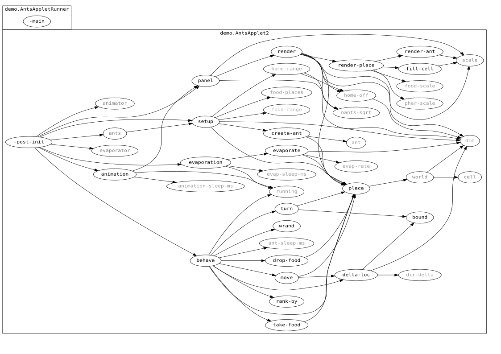

You can read a blog post about this and see a demo here:
http://juliangamble.com/blog/2011/12/28/clojure-gui-demo-of-ants/

This is Rich Hickey's ant colony simulation, and includes an update for running as an Applet. 

Feedback welcome. 

## the story (the requirement)

- Ant colony simulation
- World populated with food and ants
- Ants find food, bring home, drop pheromones
- Sense pheromones, food, home
- Ants act independently, on multiple real threads
- Model pheromone evaporation
- Animated GUI
- < 250 lines of Clojure

## call-stack diagram

[call-stack-ants.svg](call-stack-ants.svg)

